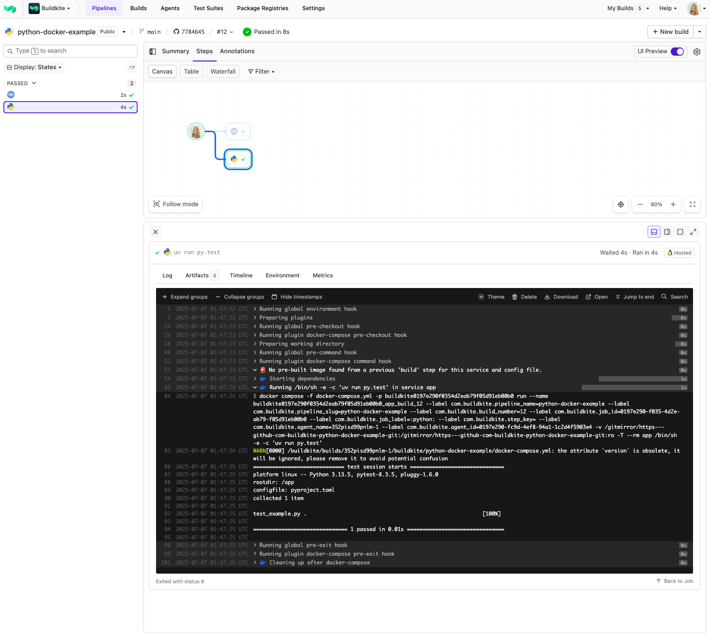

# Buildkite Python Docker Example (using uv)

This repository is an example [Buildkite](https://buildkite.com/) pipeline that tests a [Python](https://python.org) project using [Docker](https://www.docker.com/) and [uv](https://docs.astral.sh/uv/), a fast Python package manager.

👉 **See this example in action:** [buildkite/python-docker-example](https://buildkite.com/buildkite/python-docker-example/builds/latest?branch=main)

<!-- docs:start -->

## How it works

This example:
- Uses a [`Dockerfile`](Dockerfile) to set up Python and install dependencies using `uv`
- Defines an `app` service in [`docker-compose.yml`](docker-compose.yml)
- Runs the build using Docker Compose via a standard Buildkite pipeline step

<!-- docs:end -->

## License

See [LICENSE](LICENSE) (MIT)
